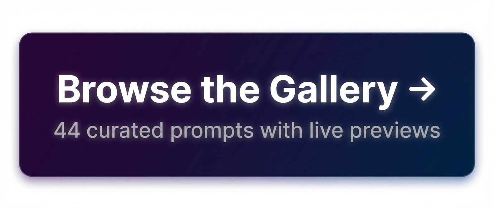
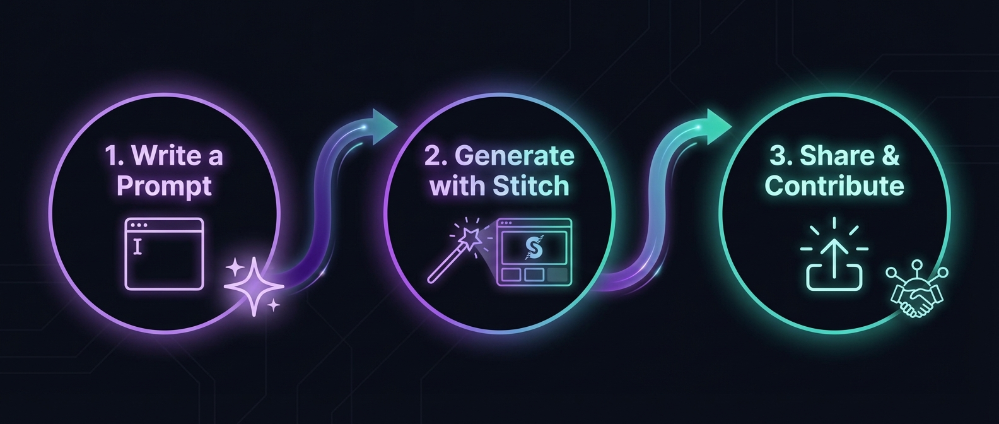

# Awesome Stitch Design [](https://awesome.re)

[](https://github.com/tygwan/awesome-stitch-design)
[](https://creativecommons.org/licenses/by/4.0/)
[](CONTRIBUTING.md)
[](https://tygwan.github.io/awesome-stitch-design/)

> A curated list of awesome design prompts, resources, tutorials, and tools for [Google Stitch](https://stitch.withgoogle.com) — the AI-powered UI design tool by Google Labs.

<p align="center">
  <a href="https://tygwan.github.io/awesome-stitch-design/">
    
  </a>
</p>

Google Stitch lets you generate high-fidelity UI designs from text prompts, voice input, or hand-drawn sketches, powered by Gemini. This list collects the best prompts, examples, and resources to help you master "vibe design."

## stitchkit — Claude Code Plugin

<p align="center">
  <a href="https://github.com/tygwan/stitchkit">
    
  </a>
</p>

Use **[stitchkit](https://github.com/tygwan/stitchkit)** to generate Stitch designs directly from Claude Code with MCP integration, design skills, and prompt templates.

```bash
claude plugin add tygwan/stitchkit
```

## How to Use

<p align="center">
  
</p>

1. **Write a Prompt** — Describe the UI you want to create (page type, layout, components, style)
2. **Generate with Stitch** — Paste the prompt into [Google Stitch](https://stitch.withgoogle.com) and generate your design
3. **Share & Contribute** — Share your best results with the community!

### Stitch Input Methods

Stitch accepts multiple input types for design generation:

| Input | Description | MCP Support |
|---|---|---|
| **Text Prompt** | Describe the UI in natural language | Stitch MCP |
| **Image/Screenshot** | Upload a reference image or existing design | Stitch Web only |
| **Sketch** | Upload a hand-drawn wireframe or sketch | Stitch Web only |
| **URL** | Provide a website URL as design reference | Stitch Web only |

> **Tip:** Use [stitchkit](https://github.com/tygwan/stitchkit) to combine Stitch (UI layouts) + [NanoBanana](https://github.com/tygwan/nanobanana-mcp) (image generation with reference support) for a complete design workflow in Claude Code.

## How to Contribute

We welcome contributions from everyone! Share your best Stitch prompts and designs:

- **[Submit via Pull Request](CONTRIBUTING.md)** — Fork, add your prompt with a preview, and submit a PR
- **[Submit via Issue](https://github.com/tygwan/awesome-stitch-design/issues/new?template=submit-resource.yml)** — Fill out the form and we'll add it for you

> Your GitHub profile will be displayed alongside your contribution in the [Gallery](https://tygwan.github.io/awesome-stitch-design/).

## Official Resources

- [Stitch](https://stitch.withgoogle.com) - Official Stitch app by Google Labs.
- [Stitch Prompt Guide](https://discuss.ai.google.dev/t/stitch-prompt-guide/83844) - Official prompting guide on Google AI Developers Forum.
- [Introducing Stitch](https://developers.googleblog.com/stitch-a-new-way-to-design-uis/) - Original announcement blog post (May 2025).
- [Stitch AI UI Design](https://blog.google/innovation-and-ai/models-and-research/google-labs/stitch-ai-ui-design/) - Major redesign announcement blog post (March 2026).
- [Stitch SDK](https://github.com/google-labs-code/stitch-sdk) - Official SDK for programmatic access (`@google/stitch-sdk`).
- [Stitch MCP Setup](https://stitch.withgoogle.com/docs/mcp/setup) - Official MCP server documentation for editor integration.
- [Design-to-Code Codelab](https://codelabs.developers.google.com/design-to-code-with-antigravity-stitch?hl=en) - Google Codelabs tutorial: Design-to-Code with Antigravity and Stitch MCP.

## Tutorials & Guides

- [Google Stitch Tutorial: AI-Powered UI Design Tool](https://www.codecademy.com/article/google-stitch-tutorial-ai-powered-ui-design-tool) - Step-by-step guide for designing mobile app UI with Stitch (Codecademy).

## SDK & MCP

- [Stitch SDK](https://github.com/google-labs-code/stitch-sdk) - Official Node.js SDK for generating screens, editing, creating variants, and extracting HTML/screenshots.
- [Stitch MCP Server (Community)](https://github.com/davideast/stitch-mcp) - Community-built MCP server for integrating Stitch with Claude Code, Cursor, and other editors.
- [stitchkit](https://github.com/tygwan/stitchkit) - Claude Code plugin for Stitch & Figma design workflows with skills, agents, and MCP setup.

## Tools & Extensions

- Stitch Figma Plugin - Import Stitch designs directly into Figma. *(Search "Stitch" in [Figma Community](https://www.figma.com/community) plugins)*
- [Antigravity](https://labs.google/antigravity) - Google Labs tool that pairs with Stitch for design-to-code workflows.

## Articles & Blog Posts

- [Google Stitch Complete Guide](https://www.nxcode.io/resources/news/google-stitch-complete-guide-vibe-design-2026) - Comprehensive guide covering all Stitch features (NxCode).
- [Google Stitch: A Product Designer's Review](https://www.bitovi.com/blog/google-stitch-a-product-designers-review) - In-depth review from a designer's perspective (Bitovi).
- [Google Stitch AI Review for UI Designers](https://www.index.dev/blog/google-stitch-ai-review-for-ui-designers) - Review focused on practical design workflows (Index.dev).
- [Google Stitch vs v0 vs Lovable](https://www.nxcode.io/resources/news/google-stitch-vs-v0-vs-lovable-ai-app-builder-2026) - Comparison of AI app builder tools (NxCode).

## Videos

- Search "Google Stitch" on [YouTube](https://www.youtube.com/results?search_query=google+stitch+ui+design) for tutorials and demos.

## Community

- [Google AI Developers Forum - Stitch](https://discuss.ai.google.dev/tag/stitch) - Official discussion forum for Stitch on Google AI Developers.
- [r/GoogleStitch](https://www.reddit.com/r/GoogleStitch/) - Reddit community for sharing Stitch designs and tips.

## Sketch to Design

*Stitch can transform hand-drawn sketches into polished UI designs. Upload a photo of your sketch and Stitch will generate a high-fidelity version.*

> **Tip:** For best results, draw clear wireframes with labeled elements. Stitch interprets layout structure, component types, and annotations.

---

## Contents

- [Marketing & Public](#marketing--public) — Landing Page, Pricing, About/Team, Blog/Article, Portfolio
- [Product & App](#product--app) — Dashboard, Settings/Profile, Onboarding/Sign-up, Chat/Messaging, Feed/Timeline
- [Commerce](#commerce) — Product Listing, Product Detail, Cart/Checkout, Order Tracking
- [Utility](#utility) — Login/Auth, 404/Error, Search Results, Email/Newsletter
- [Admin](#admin) — Admin Panel/CMS, Data Table/CRUD, Kanban Board, Calendar/Scheduling

## Prompts

### Marketing & Public

> [Stitch Project](https://stitch.withgoogle.com/project/14974846880237249166) — All Marketing & Public prompts previewed here.

#### Landing Page

- **SaaS Product Landing** - `Design a SaaS product landing page for a project management tool. Hero section with bold headline "Ship faster, together", subheadline, email signup input with CTA button, product screenshot mockup, trusted-by logo bar, 3-column feature section with icons, and a final CTA banner. Modern, clean design with indigo and white color scheme.` — Conversion-optimized layout with trust signals, feature grid, and strong CTAs.
- **Wellness App Landing** - `Design a mobile-first landing page for a meditation and wellness app. Include a calming hero with gradient background, app store download buttons, 3 benefit cards with illustrations, user testimonials carousel, and a sticky bottom CTA bar. Soft pastel color palette with rounded elements.` — Calming mobile-first page with app store CTAs and social proof.

#### Pricing Page

- **SaaS Tiered Pricing** - `Design a SaaS pricing page with 3 tiers: Free, Pro, and Enterprise. Each tier card shows price, feature list with checkmarks, and CTA button. The Pro plan is highlighted as "Most Popular" with a badge. Include a monthly/annual toggle switch, FAQ accordion section below, and a "Contact Sales" banner for enterprise. Clean white background with blue accents.` — Classic 3-tier layout with toggle billing and FAQ section.
- **Agency Comparison Pricing** - `Design a creative agency pricing page with a comparison table format. Rows for features like "Revisions", "Turnaround", "Support", columns for Starter, Growth, Scale plans. Include a slider to adjust team size that dynamically shows pricing. Dark theme with gradient accent colors and glassmorphism cards.` — Dynamic pricing table with team size slider and glassmorphism cards.

#### About / Team Page

- **Startup About Us** - `Design a startup About Us page. Include a mission statement hero with large typography, team member grid with photos, names, roles, and social links, company timeline/milestones section, office photo gallery, and a "Join Our Team" CTA. Warm, friendly design with orange accents.` — Story-driven page with team grid, timeline, and hiring CTA.
- **Creative Agency Team** - `Design a design agency team page with a creative layout. Each team member card is an overlapping photo with name overlay, hover reveals bio and social links. Include a playful "We're hiring" banner with confetti elements. Monochrome photos with a single brand color highlight.` — Artistic overlapping card layout with hover interactions.

#### Blog / Article

- **Tech Blog Article** - `Design a tech blog article page with a featured image header, article title, author avatar with name and publish date, reading time badge, body text with subheadings, inline code blocks, a table of contents sidebar, related articles section at the bottom, and newsletter signup inline. Clean editorial design with serif headings.` — Editorial layout with TOC sidebar, code blocks, and newsletter CTA.
- **Blog Listing / Magazine** - `Design a blog listing page with a featured post hero at top showing large image, title and excerpt. Below, a grid of article cards with thumbnail, category tag, title, excerpt, author, and date. Include a sidebar with popular posts, categories, and search bar. Magazine-style layout.` — Magazine-style grid with featured hero and sidebar widgets.

#### Portfolio / Showcase

- **Photographer Portfolio** - `Design a photographer portfolio page with a full-bleed masonry image grid, minimal navigation, a lightbox-style image viewer overlay, and a brief intro section with name and specialty. Black background to make photos pop. Minimal, gallery-focused design.` — Full-bleed masonry gallery with dark backdrop and lightbox viewer.
- **UX Designer Portfolio** - `Design a UI/UX designer portfolio with case study cards showing project thumbnail, client name, project type tag, and a brief result metric. Include a hero section with animated greeting, skills section with progress bars, and a contact form. Modern, geometric design with a teal accent color.` — Case study-focused portfolio with skills visualization and contact form.

---

### Product & App

> [Stitch Project](https://stitch.withgoogle.com/project/1126015643567755569) — All Product & App prompts previewed here.

#### Dashboard / Analytics

- **SaaS Analytics Dashboard** - `Design a SaaS analytics dashboard with a left sidebar navigation, top header with search and notifications. Main area has 4 KPI cards (Revenue, Users, Conversion, Churn) with sparkline charts, a large line chart for trends, a bar chart for traffic sources, and a recent activity feed. Light theme with blue primary color.` — Data-rich dashboard with KPIs, charts, and activity feed.
- **Personal Banking Dashboard** - `Design a financial dashboard for personal banking. Show account balance prominently, recent transactions list, spending breakdown donut chart by category, monthly budget progress bars, and quick action buttons (Send, Request, Pay). Dark premium theme with gold accents.` — Premium fintech dashboard with spending insights and quick actions.

#### Settings / Profile

- **Account Settings** - `Design an account settings page with a vertical tab navigation (Profile, Security, Notifications, Billing, Integrations). The Profile tab is active showing avatar upload, form fields for name, email, bio, timezone dropdown, and Save/Cancel buttons. Include a danger zone section for account deletion. Clean, organized layout.` — Tabbed settings layout with organized form sections and danger zone.
- **Mobile Profile & Settings** - `Design a mobile app profile and settings screen. Show user avatar, name, email at top, followed by grouped settings sections: Account, Preferences (dark mode toggle, language, notifications), Privacy, Support, and a Sign Out button at bottom. Use iOS-style grouped list with chevron indicators.` — iOS-style grouped settings with toggles and chevron navigation.

#### Onboarding / Sign-up

- **Multi-step Onboarding** - `Design a multi-step onboarding flow for a productivity app. Step 1 of 4: "What's your role?" with selectable role cards (Designer, Developer, PM, Marketer), a progress bar at top, Skip button, and Continue button. Friendly, welcoming design with illustrations and purple accent color.` — Guided onboarding with role selection cards and progress indicator.
- **Mobile Sign-up** - `Design a mobile sign-up screen with social login buttons (Google, Apple, GitHub), an "or" divider, email/password form fields, password strength indicator, terms checkbox, and a Sign Up button. Below, a "Already have an account? Log in" link. Minimal, modern design with rounded inputs.` — Clean sign-up with social auth and password strength feedback.

#### Chat / Messaging

- **Team Messaging (Slack-style)** - `Design a team messaging app like Slack. Left sidebar with workspace name, channels list, and direct messages. Main chat area with message thread showing text, code blocks, file attachments, emoji reactions, and timestamps. Message input with formatting toolbar. Professional design with a purple sidebar.` — Full-featured team chat with channels, threads, and rich content.
- **Dating App Chat** - `Design a mobile chat screen for a dating app. Show conversation bubbles with text and photo messages, a "matched 3 days ago" header, read receipts, typing indicator dots, and bottom input bar with GIF, photo, and voice buttons. Warm, romantic color scheme with pink gradients.` — Playful mobile chat with media sharing and read receipts.

#### Feed / Timeline

- **Social Feed (Twitter-style)** - `Design a social media feed page like Twitter/X. Include a top tab bar (For You, Following), post cards with avatar, username, timestamp, text content, image attachment, and action bar (reply, repost, like, share counts). Right sidebar with trending topics and suggested follows. Clean, content-focused layout.` — Content-first social feed with engagement actions and trending sidebar.
- **News Feed** - `Design a mobile news feed with card-based articles. Each card has a hero image, source logo, headline, brief excerpt, bookmark icon, and share button. Include pull-to-refresh indicator, category filter chips at top (All, Tech, Design, Business), and a floating compose button. Modern editorial style.` — Card-based news reader with category filters and bookmarking.

---

### Commerce

> [Stitch Project](https://stitch.withgoogle.com/project/2157348259102091111) — All Commerce prompts previewed here.

#### Product Listing

- **Fashion Store Catalog** - `Design an e-commerce product listing page for a fashion store. Include a top filter bar with sort dropdown, grid/list view toggle, and active filter chips. Product cards show image, brand name, product title, price, discount badge, star rating, and wishlist heart icon. Sidebar with category tree, price range slider, size and color filters. Clean, modern layout.` — Filterable product grid with sidebar facets and wishlist actions.
- **Furniture Store Catalog** - `Design a mobile product catalog for a furniture store. Grid of product cards with lifestyle photos, product name, price, and add-to-cart icon. Include a sticky search bar at top, horizontal category scroll (Living Room, Bedroom, Office, Kitchen), and a floating cart button with item count badge. Warm, Scandinavian-inspired aesthetic.` — Scandinavian-style mobile catalog with category scroll and sticky cart.

#### Product Detail

- **Premium Headphone PDP** - `Design a product detail page for a premium headphone. Large product image with 360-degree view button, image thumbnails below, product name, star rating with review count, price with strike-through original price, color swatches, quantity selector, Add to Cart and Buy Now buttons, tabbed section for Description, Specs, and Reviews. Apple-inspired minimal style.` — Apple-inspired PDP with 360 view, variant selectors, and tabbed specs.
- **Skincare Product Page** - `Design a mobile product page for a skincare product. Full-width product image with swipe dots, sticky bottom bar with price and Add to Cart button, ingredient list with expandable sections, before/after comparison slider, customer photo reviews, and "You might also like" product carousel. Clean beauty aesthetic with soft pink tones.` — Beauty-focused PDP with ingredients, comparison slider, and photo reviews.

#### Cart / Checkout

- **Shopping Cart** - `Design a shopping cart page. List of cart items with product image, name, size, color, quantity stepper, unit price, and remove button. Right sidebar with order summary: subtotal, shipping estimate, tax, promo code input, total, and Checkout button. Include a "You may also like" product row below. Clean e-commerce layout.` — Standard cart with item management, order summary, and cross-sell.
- **Payment Checkout** - `Design a multi-step checkout flow showing step 2 of 3: Payment. Include a step indicator at top (Shipping > Payment > Review), saved card selection with radio buttons, add new card form with card number, expiry, CVV fields, a card preview graphic that updates live, billing address toggle, and Back/Continue buttons. Secure, trustworthy design with lock icons.` — Multi-step checkout with live card preview and trust indicators.

#### Order Tracking

- **Package Tracking** - `Design an order tracking page. Show order status with a horizontal stepper (Confirmed, Processing, Shipped, Delivered) with the "Shipped" step active and highlighted. Include a map showing delivery route, estimated delivery date, carrier info, package details with product thumbnails, and a "Contact Support" button. Clean, informative layout.` — Status stepper with map tracking and delivery details.
- **Food Delivery Tracking** - `Design a mobile order tracking screen for a food delivery app. Show a real-time map with driver location pin, estimated arrival countdown timer, driver info card with photo, name, rating and call/message buttons, order items list, and a progress bar (Preparing > Picked Up > On the Way > Delivered). Bright, friendly design.` — Real-time delivery map with driver info and live countdown.

---

### Utility

> [Stitch Project](https://stitch.withgoogle.com/project/10175925422570894411) — All Utility prompts previewed here.

#### Login / Auth

- **SaaS Split Login** - `Design a desktop login page with a split layout: left side has a large brand illustration with motivational tagline, right side has the login form with logo, "Welcome back" heading, email and password fields, "Remember me" checkbox, "Forgot password?" link, Sign In button, social login divider with Google and GitHub buttons, and "Create account" link. Professional SaaS style.` — Split-screen login with brand illustration and social auth options.
- **Mobile App Login** - `Design a mobile login screen with a gradient background, centered logo, email and password input fields with icons, a biometric login option (Face ID / fingerprint icon), Sign In button, and social login options at the bottom. Sleek, modern app design with rounded corners and subtle shadows.` — Gradient mobile login with biometric and social auth.

#### 404 / Error Page

- **Space-themed 404** - `Design a creative 404 error page. Show a large "404" number with a fun illustration of an astronaut floating in space. Include a witty message "Looks like you're lost in space", a search bar, "Go Home" and "Go Back" buttons, and suggested popular links below. Playful design with a dark space-themed background.` — Illustrated space-themed 404 with search and navigation aids.
- **Friendly 404** - `Design a minimal 404 page with a large animated character illustration looking confused, a simple "Page not found" message, a brief explanation, and a prominent "Return Home" button. Include breadcrumbs and the site header for navigation context. Light, friendly design with pastel colors.` — Minimal, welcoming 404 with character illustration.

#### Search Results

- **Documentation Search** - `Design a search results page for a documentation site. Include a search input with instant suggestions, filter sidebar with categories and tags, result cards showing title with highlighted matching text, breadcrumb path, content preview snippet, and relevance score. Include pagination and "No results" empty state variation. Clean, developer-focused design.` — Developer docs search with highlighted matches and faceted filters.
- **Travel App Search** - `Design a mobile search screen for a travel app. Show a search bar with recent searches list, trending destinations with thumbnail images, popular filters as tappable chips (Beach, Mountain, City, Budget-friendly), and autocomplete suggestions dropdown. Clean, intuitive search UX with a white background.` — Travel search with recent/trending suggestions and filter chips.

#### Email / Newsletter

- **Product Launch Email** - `Design an email newsletter template for a tech product launch. Include a header with logo, hero banner with product image and launch date, feature highlights section with 3 icon-text blocks, a CTA button "Get Early Access", social media links, and an unsubscribe footer. Modern, responsive email layout with a dark hero section.` — Product launch email with hero banner, features, and early access CTA.
- **Weekly Digest Email** - `Design a weekly digest email template for a SaaS analytics tool. Include a personalized greeting, key metrics summary cards (Weekly Active Users, Revenue, Top Feature), a mini chart visualization, a "View Full Report" CTA button, tips section, and footer with preference management link. Clean, data-focused email design.` — Data-driven weekly digest with inline metrics and report CTA.

---

### Admin

> [Stitch Project](https://stitch.withgoogle.com/project/515752841948986130) — All Admin prompts previewed here.

#### Admin Panel / CMS

- **Blog CMS** - `Design a CMS admin panel for a blog platform. Left sidebar with navigation (Dashboard, Posts, Pages, Media, Comments, Users, Settings). Main area shows a posts list with bulk actions toolbar, data table with columns for title, author, status badge (Published/Draft), category, date, and action buttons. Include a "New Post" primary button. Clean admin UI.` — Content management panel with posts table and bulk actions.
- **Multi-tenant SaaS Admin** - `Design an admin dashboard for a multi-tenant SaaS platform. Show tenant overview cards with active users, subscription tier, and status indicators. Include a system health section with uptime percentage, API response time chart, error rate gauge. Feature flags toggle list and a deployment timeline. Technical admin design with a dark sidebar.` — Platform admin with tenant overview, health metrics, and feature flags.

#### Data Table / CRUD

- **User Management Table** - `Design a data table page for user management in an admin panel. Show a table with columns: checkbox, avatar, name, email, role dropdown, status toggle, last active date, and actions menu (Edit, Suspend, Delete). Include top bar with search, role filter dropdown, "Add User" button, and bulk action buttons. Pagination at bottom. Enterprise admin style.` — Enterprise user table with inline actions and bulk operations.
- **Inventory CRUD** - `Design a CRUD interface for managing products in an inventory system. Split view: left side has a filterable, sortable data table with product ID, name, SKU, stock level (color-coded low/ok/high), price, and category. Right side shows a detail/edit panel for the selected product with form fields and Save/Delete buttons. Functional, dense admin layout.` — Split-view CRUD with data table and inline edit panel.

#### Kanban Board

- **Project Kanban** - `Design a Kanban project board with 4 columns: Backlog, To Do, In Progress, Done. Each task card shows title, priority label (High/Medium/Low color-coded), assignee avatar, due date, subtask progress bar, and comment count. Include a top bar with board title, view toggle (Board/List/Timeline), filters, and "Add Task" button. Drag handle indicators on cards. Clean project management style.` — Full-featured Kanban with priority labels, subtasks, and view toggles.
- **Sprint Planning Board** - `Design a sprint planning board for an agile development team. Columns for Sprint Backlog, In Development, Code Review, QA, and Released. Cards show ticket ID, title, story points badge, assignee, and type icon (Bug, Feature, Task). Include sprint progress bar, velocity chart widget, and a sprint goal banner at top. Developer-focused, information-dense layout.` — Agile sprint board with velocity tracking and story points.

#### Calendar / Scheduling

- **Team Calendar** - `Design a calendar scheduling page for a team workspace. Show a weekly view with time slots on the left axis, day columns with color-coded event blocks showing title, time, and attendee avatars. Include a mini monthly calendar in the sidebar, upcoming events list, and a "New Event" floating action button. Clean, Google Calendar-inspired design with a blue accent color.` — Weekly team calendar with color-coded events and mini month view.
- **Medical Appointment Booking** - `Design a booking calendar for a medical appointment system. Monthly view with available dates highlighted in green, selected date shows available time slots as tappable buttons. Include doctor profile card with photo, name, specialty, and rating. Side panel shows booking summary with date, time, doctor, and "Confirm Booking" button. Professional healthcare design with calming blue-green tones.` — Healthcare booking with availability calendar and doctor profiles.

---

## Contributing

Contributions are welcome! Please read the [contributing guidelines](CONTRIBUTING.md) first. You can also [submit a resource via Issue](https://github.com/tygwan/awesome-stitch-design/issues/new?template=submit-resource.yml).

## License

[](https://creativecommons.org/licenses/by/4.0/)

This work is licensed under a [Creative Commons Attribution 4.0 International License](https://creativecommons.org/licenses/by/4.0/).
